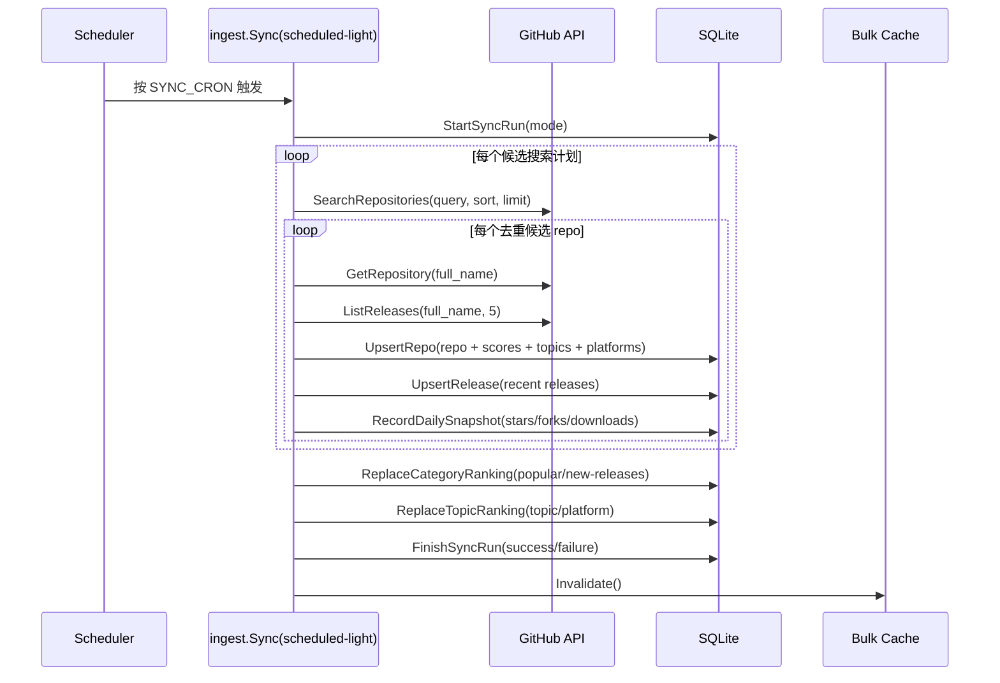
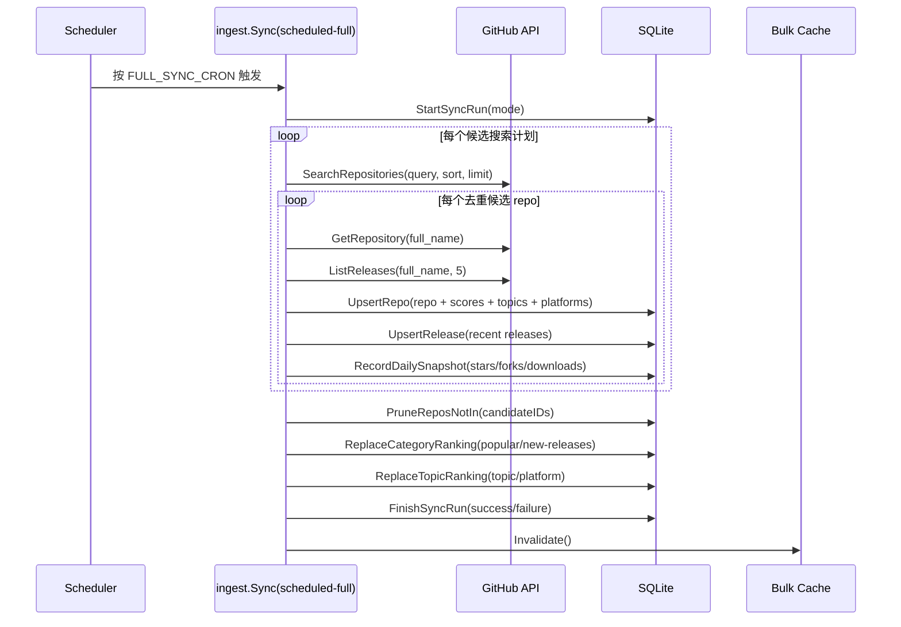

# Starcat Discovery API

<!-- starcat-promo:start -->
<div align="center">
<a href="https://starcat.ink"></a>

<p><strong>这是 Starcat 探索、热门、新发布仓库 feed 的可自部署支撑服务。</strong></p>
<p>Starcat 是一款原生 macOS 应用，可以把 GitHub Stars 变成可搜索、可整理、可用 AI 追问的本地知识库。当前 1.4.0 支持 README 渲染、知识库 RAG、GitHub 通知、我的项目、全局与仓库洞察、macOS 桌面小组件、标签与私有笔记、Release 追踪、仓库健康度、AI 摘要、语义搜索、浏览器插件，以及 Alfred / uTools / Raycast 外部搜索，并提供多个可自部署 API。</p>

<a href="https://github.com/starcat-app/homebrew-starcat"></a>
<br/>
<sub><a href="./README.md">English</a></sub>
</div>

<div align="center">
<a href="https://starcat.ink"></a>
<a href="https://github.com/starcat-app/starcat-pro"></a>
<a href="https://github.com/starcat-app/homebrew-starcat"></a>
<a href="https://github.com/starcat-app/starcat-localization"></a>
</div>

<div align="center">

</div>

**首选 Homebrew 安装：**

```bash
brew tap starcat-app/starcat
brew trust starcat-app/starcat
brew install --cask starcat
```

**相关链接：**

- 官网与下载: https://starcat.ink
- Mac App Store: 搜索 Starcat for GitHub
- 当前 Direct 版本: https://starcat.ink/downloads/Starcat-1.4.0-arm64.dmg
- 公开支持与发布说明: https://github.com/starcat-app/starcat-pro
- Starcat App Homebrew tap: https://github.com/starcat-app/homebrew-starcat
- CLI / MCP: [starcat-cli](https://github.com/starcat-app/starcat-cli) / [Homebrew tap](https://github.com/starcat-app/homebrew-starcat-cli)
- AI Agent Skill: https://github.com/starcat-app/starcat-skill
- 浏览器插件: [Chrome](https://github.com/starcat-app/starcat-chrome-plugin) / [Safari](https://github.com/starcat-app/starcat-safari-plugin)
- 启动器集成: [Alfred](https://github.com/starcat-app/starcat-alfred-workflow) / [uTools](https://github.com/starcat-app/starcat-utools-plugin) / [Raycast](https://github.com/starcat-app/starcat-raycast-extension)
- 官方文档: https://github.com/starcat-app/starcat-docs
- 官网源码: https://github.com/starcat-app/starcat-site
- 本地化: https://github.com/starcat-app/starcat-localization

**可自部署支撑 API：**

- [starcat-sharing-api](https://github.com/starcat-app/starcat-sharing-api)
- [starcat-trending-api](https://github.com/starcat-app/starcat-trending-api)
- [starcat-weekly-api](https://github.com/starcat-app/starcat-weekly-api)
- [starcat-wiki-api](https://github.com/starcat-app/starcat-wiki-api)
- [starcat-recommend-api](https://github.com/starcat-app/starcat-recommend-api)
- [starcat-discovery-api](https://github.com/starcat-app/starcat-discovery-api)

> Starcat 为普通用户提供默认托管服务。这个 API 开源出来，是为了让进阶用户可以审查实现、本地运行，或部署自己的实例。
<!-- starcat-promo:end -->

`starcat-discovery-api` 为 Starcat 提供发现流、热门榜单、新发布榜单，以及按需开启的公开仓库星标历史缓存，并保留新版趋势候选诊断接口。

本服务独立于 `starcat-trending-api`。旧趋势链路保持不变，新服务只负责 Discovery 相关能力。

## 特性

- Go 标准库 `net/http`
- 统一 envelope 响应
- 普通 API Key 与 Admin API Key 分离
- SQLite 持久化，Fly.io volume 保存数据
- GitHub PAT 池驱动 Search / repo / release ingest
- Awesome 精选来源内容管理、GFM AST 解析、持久化同步任务与独立 ETag 快照
- 有界异步星标历史 worker、SQLite 缓存、ETag 与查询预算护栏
- 开源友好的 README、LICENSE、CONTRIBUTING、SECURITY、Dockerfile、Fly.io 配置

## 快速开始

```bash
cp .env.example .env
# 编辑 .env，填入 API_KEYS、ADMIN_API_KEYS、GITHUB_TOKENS
go run ./cmd/server/
```

默认端口为 `5006`。

## 环境变量

| 变量 | 必填 | 默认值 | 说明 |
|---|---:|---|---|
| `PORT` | 否 | `5006` | HTTP 端口 |
| `STORE_FILE` | 否 | `./discovery.db` | SQLite 文件路径 |
| `API_KEYS` | 是 | 无 | Starcat 客户端读取接口 key |
| `ADMIN_API_KEYS` | 是 | 无 | `/internal/*` 管理接口 key |
| `GITHUB_TOKENS` | 是 | 无 | GitHub PAT 池，逗号分隔 |
| `SYNC_ENABLED` | 否 | `true` | 是否启动定时同步 |
| `SYNC_CRON` | 否 | `17 */3 * * *` | 轻同步 cron |
| `FULL_SYNC_CRON` | 否 | `23 2 * * *` | 全量同步 cron |
| `CACHE_TTL_SECONDS` | 否 | `10800` | `/discovery/bulk` 与 Awesome 公共响应的进程内缓存 TTL |
| `FEED_TARGET_SIZE` | 否 | `500` | 每轮 GitHub Search 的全局候选预算，服务端最高限制为 `1600` |
| `STAR_HISTORY_ENABLED` | 否 | `false` | 是否开启 GH Archive / BigQuery 星标历史 Provider |
| `STAR_HISTORY_CACHE_TTL_SECONDS` | 否 | `86400` | 成功历史缓存 TTL |
| `STAR_HISTORY_NEGATIVE_TTL_SECONDS` | 否 | `600` | 构建失败负缓存 TTL |
| `STAR_HISTORY_BUILD_TIMEOUT_SECONDS` | 否 | `300` | 单次 worker 构建超时 |
| `STAR_HISTORY_WORKER_CONCURRENCY` | 否 | `1` | 固定 worker 数量 |
| `STAR_HISTORY_QUEUE_CAPACITY` | 否 | `32` | 待构建任务有界队列容量 |
| `STAR_HISTORY_MAX_POINTS` | 否 | `500` | 单个返回序列最大点数 |
| `GCP_PROJECT_ID` | 开启时 | 无 | 参数化 BigQuery 查询的计费项目 |
| `GOOGLE_APPLICATION_CREDENTIALS_JSON` | 否 | ADC | 只能通过服务端 secret 注入的 service account JSON |
| `BIGQUERY_MAX_BYTES_BILLED` | 开启时 | 无 | 单仓构建的扫描字节硬上限 |
| `STAR_HISTORY_DAILY_MAX_BYTES_BILLED` | 开启时 | 无 | worker 按 UTC 日期持久化的每日保守预算，至少覆盖一次查询 |

星标历史在 GH Archive / BigQuery M0 查询与成本验证获得单独授权并完成前保持关闭；普通部署不会自动开启。
首次构建会使用服务端 GitHub 仓库元数据中的 `created_at` 裁剪 BigQuery 日期范围，不扫描仓库创建前的 GH Archive 日表。

## API

所有 `/api/v1/*` 接口需要 `Authorization: Bearer <API_KEYS>`。

```text
GET /healthz
GET /api/v1/ping
GET /api/v1/discovery/feed
GET /api/v1/discovery/categories/most-popular
GET /api/v1/discovery/categories/new-releases
GET /api/v1/discovery/summary
GET /api/v1/discovery/bulk
GET /api/v1/discovery/languages
GET /api/v1/discovery/topics
GET /api/v1/discovery/platforms
GET /api/v1/discovery/awesome/sources
GET /api/v1/discovery/awesome/sources/{source_id}/entries
GET /api/v1/repos/{owner}/{repo}/star-history?repo_id={id}&range=3m|1y|all
GET /internal/discovery/trending-candidates
POST /internal/sync/discovery
GET|POST /internal/discovery/awesome/sources
PATCH /internal/discovery/awesome/sources/{source_id}
POST /internal/discovery/awesome/sources/{source_id}/sync|publish|archive
GET /internal/discovery/awesome/sources/{source_id}/sync-runs
```

`GET /api/v1/ping` 返回鉴权后的服务标识，以及由发布 tag 注入的构建版本：

```json
{"schema_version":1,"data":{"service":"discovery","version":"1.2.3","ok":true}}
```

发现 / 热门 / 新发布接口读取 SQLite 预计算结果；`/discovery/bulk` 提供 Starcat 本地优先缓存所需的完整公开 catalog 快照。管理同步入口触发 GitHub ingest 与榜单重建。趋势候选只保留在 `/internal/discovery/trending-candidates`，需要 Admin API Key，不进入 summary / bulk / Starcat UI，客户端当前仍使用既有 `starcat-trending-api`。

Awesome 使用独立来源目录和单来源 entries 快照，不并入 discovery bulk。运营来源先创建为草稿，成功同步至少一个公开 GitHub Repo 后进入 ready，再显式发布；下架保留来源和最近成功快照。README 通过 CommonMark/GFM AST 解析，外部链接只保留运营统计，不进入客户端 Repo 列表。发布来源随常规轻同步 cron 刷新，管理端也可单独触发。SQLite 持久快照可跨进程重启复用；公共 Awesome 响应另使用有界进程内 LRU 复用已编码 JSON、gzip 和 ETag，最多 64 条 / 64 MiB，同 key 并发 miss 只构建一次，来源变更时精确失效。

星标历史接口必填稳定 GitHub `repo_id`。缓存命中返回带 `ETag` 和 `Cache-Control` 的 `200`；公开仓库首次 miss 经 ID 与 owner/name 校验后返回 `202 + Retry-After: 5`，由有界 worker 异步构建。私有仓库会被拒绝。完整响应和错误契约见 [`docs/api.md`](docs/api.md)。

## 同步与分类逻辑

### 轻量同步



轻量同步由 `SYNC_CRON` 控制，默认 `17 */3 * * *`，即每 3 小时一次。它从 GitHub Search 拉候选仓库，再为每个候选仓库拉 repo 详情和最近 5 个 releases，写入或更新 `repos`、`repo_releases`、`repo_topic_codes`、`repo_platform_codes`、`repo_daily_snapshots`、`category_rankings`、`topic_rankings` 和 `sync_runs`。轻量同步只做 upsert 和排名重建，不删除这轮没命中的旧 repo。

### 全量同步



全量同步由 `FULL_SYNC_CRON` 控制，默认 `23 2 * * *`，即每天 UTC 02:23 一次。它和轻量同步拉取同样的候选 repo、repo 详情和 release 数据，但会额外执行 `PruneReposNotIn(candidateIDs)`，删除本轮 GitHub Search 候选集之外的旧 repo。因此全量同步不是让数据无限增长，而是把 catalog 收敛到当前搜索计划命中的滚动候选集合。

候选发现仍围绕 `llm`、`machine-learning`、`privacy`、`networking`、`media`、`social`、`rss`、`cli` 这 8 个主题，但每个主题不再只取 stars 头部。`FEED_TARGET_SIZE` 是每轮同步的全局候选预算，默认 `500`、最高 `1600`；预算按主题均分后，再按「头部 50% / 近 30 天活跃 30% / 近一年新兴 20%」拆分搜索，并在入库前按 GitHub repo id 去重。这样可以让候选成员随活跃度和新项目变化，同时继续由固定预算与全量同步裁剪保证 catalog 有界。

### 发现 / 热门 / 新发布

| 分类 | 数据来源 | 规则 | 默认排序 |
|---|---|---|---|
| 发现 | `repos` 全量 catalog，并结合 `topic_rankings` 提供 topic / platform 预计算排名 | 仓库来自同步 seed 命中的候选集；同步时按仓库元数据和 seed topic 生成 topics，按仓库属性和 releases 推断 platforms；接口可按 topic、platform、language 等条件筛选 | `discovery_score DESC`，同分时按 stars 和 repo id 兜底 |
| 热门 | `category_rankings(category = "most-popular")` | 非 archived、非 fork，且满足 `stars >= 1000` 或 `popularity_score >= 0.65` | `popularity_score DESC`，按 bucket 预计算 rank |
| 新发布 | `category_rankings(category = "new-releases")` | 非 archived、非 fork；存在最近 180 天内的 stable release；该 release 不是 draft / prerelease，且 assets 非空 | `latest_release_at DESC`，再按 `release_score DESC`、stars、repo id 兜底 |

`/api/v1/discovery/bulk` 返回完整公开 catalog 和 summary，供 Starcat 客户端本地优先缓存后在本地完成筛选、排序和分页。后端 bulk 进程内缓存 TTL 由 `CACHE_TTL_SECONDS` 控制，默认 10800 秒（3 小时），与默认轻量同步周期和客户端 freshness 窗口一致；每次同步成功后会主动失效该缓存，下一次 `/bulk` 请求会重新从 SQLite 构建响应。

## 部署

```bash
fly secrets set \
  API_KEYS="sk-starcat-prodKey" \
  ADMIN_API_KEYS="sk-starcat-adminKey" \
  GITHUB_TOKENS="ghp_token1,ghp_token2" \
  STORE_FILE="/data/discovery.db" \
  -a starcat-discovery-api

fly deploy -a starcat-discovery-api
```

更多说明见 `docs/DEPLOY_FLY.md`。
