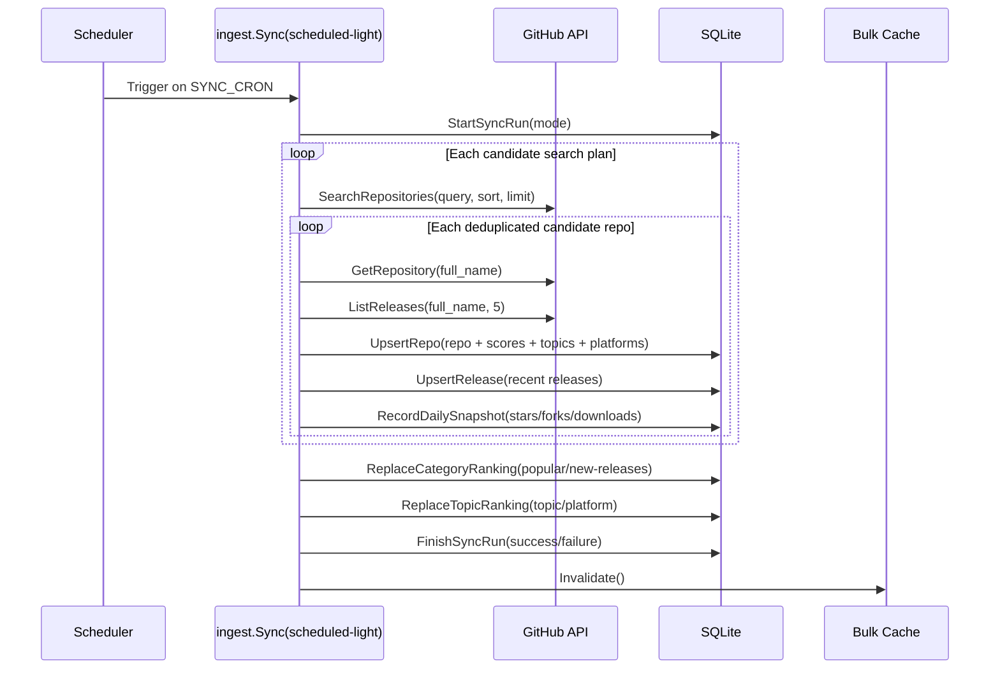
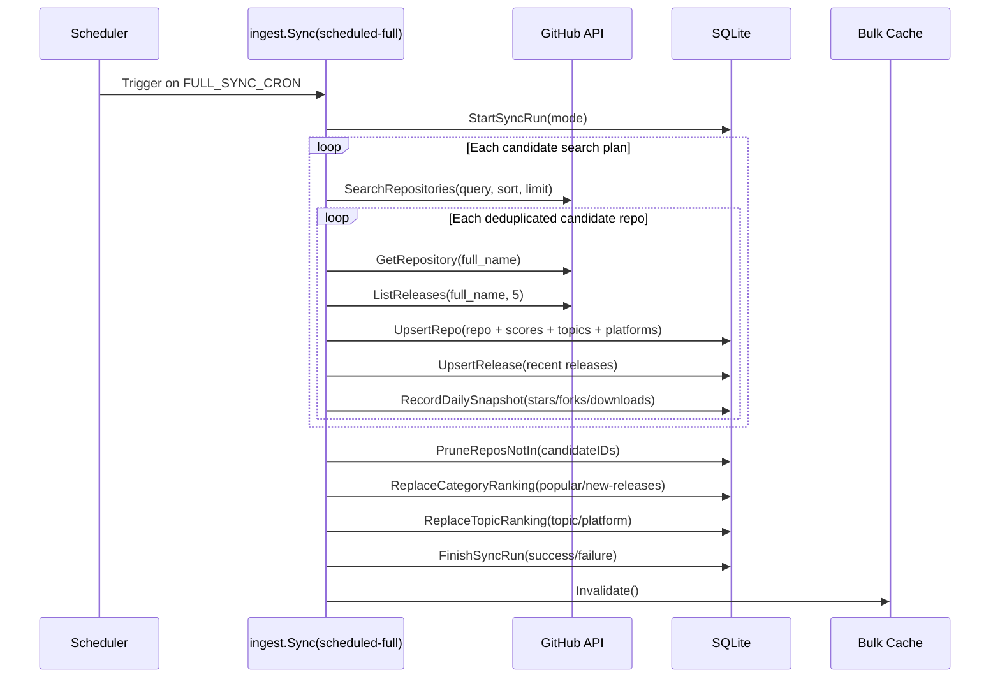

# Starcat Discovery API

<!-- starcat-promo:start -->
<div align="center">
<a href="https://starcat.ink"></a>

<p><strong>Self-hostable support API for Starcat discovery, hot repositories and new-release feeds.</strong></p>
<p>Starcat is a native macOS app that turns GitHub Stars into a searchable, organized and AI-assisted knowledge base. It supports README rendering, tags, private notes, release tracking, repository health signals, AI summaries, semantic search, browser plugin workflows and self-hostable support APIs.</p>

<a href="https://github.com/starcat-app/homebrew-starcat"></a>
<br/>
<sub><a href="./README-ZH.md">中文说明</a></sub>
</div>

<div align="center">
<a href="https://starcat.ink"></a>
<a href="https://github.com/starcat-app/starcat-pro"></a>
<a href="https://github.com/starcat-app/homebrew-starcat"></a>
<a href="https://github.com/starcat-app/starcat-localization"></a>
</div>

<div align="center">

</div>

**Preferred install method:**

```bash
brew tap starcat-app/starcat
brew trust starcat-app/starcat
brew install --cask starcat
```

**Useful links:**

- Home and downloads: https://starcat.ink
- Public support and release notes: https://github.com/starcat-app/starcat-pro
- Starcat App Homebrew tap: https://github.com/starcat-app/homebrew-starcat
- CLI / MCP: [starcat-cli](https://github.com/starcat-app/starcat-cli) / [Homebrew tap](https://github.com/starcat-app/homebrew-starcat-cli)
- AI Agent Skill: https://github.com/starcat-app/starcat-skill
- Browser plugins: [Chrome](https://github.com/starcat-app/starcat-chrome-plugin) / [Safari](https://github.com/starcat-app/starcat-safari-plugin)
- Localization: https://github.com/starcat-app/starcat-localization

**Self-hostable support APIs:**

- [starcat-sharing-api](https://github.com/starcat-app/starcat-sharing-api)
- [starcat-trending-api](https://github.com/starcat-app/starcat-trending-api)
- [starcat-weekly-api](https://github.com/starcat-app/starcat-weekly-api)
- [starcat-wiki-api](https://github.com/starcat-app/starcat-wiki-api)
- [starcat-recommend-api](https://github.com/starcat-app/starcat-recommend-api)
- [starcat-discovery-api](https://github.com/starcat-app/starcat-discovery-api)

> Starcat provides hosted defaults for normal users. This API is open source so advanced users can inspect it, run it locally, or deploy their own instance.
<!-- starcat-promo:end -->

`starcat-discovery-api` provides the discovery feed, popular repository rankings, new-release rankings, and an opt-in public-repository star-history cache for Starcat. It also retains a diagnostic endpoint for the new trending candidate pipeline.

This service is independent of `starcat-trending-api`. The existing trending pipeline remains unchanged, while this service handles Discovery features only.

## Features

- Go standard library `net/http`
- Consistent envelope responses
- Separate standard and admin API keys
- SQLite persistence backed by a Fly.io volume
- GitHub PAT pool for Search, repository, and release ingestion
- Bounded asynchronous star-history workers with SQLite cache, ETag, and query budget guards
- Open-source project files: README, LICENSE, CONTRIBUTING, SECURITY, Dockerfile, and Fly.io configuration

## Quick Start

```bash
cp .env.example .env
# Edit .env and set API_KEYS, ADMIN_API_KEYS, and GITHUB_TOKENS
go run ./cmd/server/
```

The default port is `5006`.

## Environment Variables

| Variable | Required | Default | Description |
|---|---:|---|---|
| `PORT` | No | `5006` | HTTP port |
| `STORE_FILE` | No | `./discovery.db` | SQLite file path |
| `API_KEYS` | Yes | None | Keys for Starcat client read endpoints |
| `ADMIN_API_KEYS` | Yes | None | Keys for `/internal/*` admin endpoints |
| `GITHUB_TOKENS` | Yes | None | Comma-separated GitHub PAT pool |
| `SYNC_ENABLED` | No | `true` | Enables scheduled synchronization |
| `SYNC_CRON` | No | `17 */3 * * *` | Light sync cron schedule |
| `FULL_SYNC_CRON` | No | `23 2 * * *` | Full sync cron schedule |
| `CACHE_TTL_SECONDS` | No | `10800` | In-memory cache TTL for `/discovery/bulk` |
| `FEED_TARGET_SIZE` | No | `500` | Global GitHub Search candidate budget per sync, capped by the service at `1600` |
| `STAR_HISTORY_ENABLED` | No | `false` | Enables the GH Archive / BigQuery star-history provider |
| `STAR_HISTORY_CACHE_TTL_SECONDS` | No | `86400` | Successful history cache TTL |
| `STAR_HISTORY_NEGATIVE_TTL_SECONDS` | No | `600` | Failed-build negative cache TTL |
| `STAR_HISTORY_BUILD_TIMEOUT_SECONDS` | No | `300` | Per-build worker timeout |
| `STAR_HISTORY_WORKER_CONCURRENCY` | No | `1` | Fixed worker count |
| `STAR_HISTORY_QUEUE_CAPACITY` | No | `32` | Bounded pending build capacity |
| `STAR_HISTORY_MAX_POINTS` | No | `500` | Maximum points returned per series |
| `GCP_PROJECT_ID` | When enabled | None | Billing project used for parameterized BigQuery queries |
| `GOOGLE_APPLICATION_CREDENTIALS_JSON` | No | ADC | Service-account JSON injected only as a server secret |
| `BIGQUERY_MAX_BYTES_BILLED` | When enabled | None | Hard maximum bytes billed for one repository build |
| `STAR_HISTORY_DAILY_MAX_BYTES_BILLED` | When enabled | None | Persistent UTC daily worker budget; must cover at least one query |

Star history remains disabled until the GH Archive / BigQuery M0 query and cost validation is explicitly authorized and completed. Enabling it does not happen as part of a normal deployment.
The initial build bounds its BigQuery date range with the repository `created_at` returned by the server-side GitHub request, so it does not scan GH Archive daily tables from before the repository existed.

## API

All `/api/v1/*` endpoints require `Authorization: Bearer <API_KEYS>`.

```text
GET /healthz
GET /api/v1/ping
GET /api/v1/discovery/feed
GET /api/v1/discovery/categories/most-popular
GET /api/v1/discovery/categories/new-releases
GET /api/v1/discovery/summary
GET /api/v1/discovery/bulk
GET /api/v1/discovery/languages
GET /api/v1/discovery/topics
GET /api/v1/discovery/platforms
GET /api/v1/repos/{owner}/{repo}/star-history?repo_id={id}&range=3m|1y|all
GET /internal/discovery/trending-candidates
POST /internal/sync/discovery
```

`GET /api/v1/ping` returns the authenticated service identity and the build version injected from the release tag:

```json
{"schema_version":1,"data":{"service":"discovery","version":"1.2.3","ok":true}}
```

The discovery, popular, and new-release endpoints read precomputed results from SQLite. `/discovery/bulk` provides the complete public catalog snapshot required by Starcat's local-first cache. The admin sync endpoint triggers GitHub ingestion and rebuilds the rankings. Trending candidates remain available only through `/internal/discovery/trending-candidates`, which requires an Admin API Key. They are excluded from summary, bulk, and the Starcat UI. The client continues to use the existing `starcat-trending-api`.

The star-history endpoint requires a stable GitHub `repo_id`. A cache hit returns `200` with `ETag` and `Cache-Control`; the first valid public-repository miss returns `202` plus `Retry-After: 5` while a bounded worker prepares the cache. The service rejects private repositories and verifies that the ID still matches `owner/repo`. See [`docs/api.md`](docs/api.md) for the complete response and error contract.

## Synchronization and Classification

### Light Sync



`SYNC_CRON` controls the light sync. Its default schedule, `17 */3 * * *`, runs every three hours. It fetches candidate repositories from GitHub Search, then fetches repository details and the five most recent releases for each candidate. It inserts or updates `repos`, `repo_releases`, `repo_topic_codes`, `repo_platform_codes`, `repo_daily_snapshots`, `category_rankings`, `topic_rankings`, and `sync_runs`. A light sync only performs upserts and rebuilds rankings; it does not delete existing repositories that are absent from the current results.

### Full Sync



`FULL_SYNC_CRON` controls the full sync. Its default schedule, `23 2 * * *`, runs daily at 02:23 UTC. It fetches the same candidate repositories, repository details, and release data as a light sync. It also runs `PruneReposNotIn(candidateIDs)` to delete existing repositories outside the current GitHub Search candidate set. This keeps the catalog aligned with the current rolling candidate set instead of allowing unbounded growth.

Candidate discovery still covers the eight `llm`, `machine-learning`, `privacy`, `networking`, `media`, `social`, `rss`, and `cli` topics, but each topic no longer samples only the highest-starred repositories. `FEED_TARGET_SIZE` is a global per-sync candidate budget, defaulting to `500` and capped at `1600`. After being distributed across topics, each topic's budget is split into 50% head, 30% active in the last 30 days, and 20% emerging in the last year. Results are deduplicated by GitHub repository ID before ingestion. This allows membership to react to activity and new projects while the fixed budget and full-sync pruning keep the catalog bounded.

### Discovery, Popular, and New Releases

| Category | Data Source | Rules | Default Sort |
|---|---|---|---|
| Discovery | The complete `repos` catalog, with precomputed topic and platform rankings from `topic_rankings` | Repositories come from the candidate set matched by sync seeds. During synchronization, topics are generated from repository metadata and seed topics, while platforms are inferred from repository attributes and releases. The endpoint supports filters such as topic, platform, and language. | `discovery_score DESC`, then stars and repository ID as tie-breakers |
| Popular | `category_rankings(category = "most-popular")` | Excludes archived repositories and forks; requires `stars >= 1000` or `popularity_score >= 0.65` | `popularity_score DESC`, with rank precomputed per bucket |
| New Releases | `category_rankings(category = "new-releases")` | Excludes archived repositories and forks; requires a stable release from the last 180 days that is neither a draft nor a prerelease and has at least one asset | `latest_release_at DESC`, then `release_score DESC`, stars, and repository ID as tie-breakers |

`/api/v1/discovery/bulk` returns the complete public catalog and summary. The Starcat client stores this data in its local-first cache and performs filtering, sorting, and pagination locally. `CACHE_TTL_SECONDS` controls the server's in-memory bulk cache TTL, which defaults to 10800 seconds (3 hours), matching the default incremental sync cadence and the client's freshness window. Each successful sync invalidates the cache, so the next `/bulk` request rebuilds the response from SQLite.

## Deployment

```bash
fly secrets set \
  API_KEYS="sk-starcat-prodKey" \
  ADMIN_API_KEYS="sk-starcat-adminKey" \
  GITHUB_TOKENS="ghp_token1,ghp_token2" \
  STORE_FILE="/data/discovery.db" \
  -a starcat-discovery-api

fly deploy -a starcat-discovery-api
```

See `docs/DEPLOY_FLY.md` for more information.
